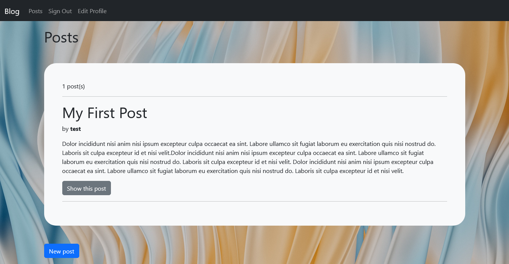
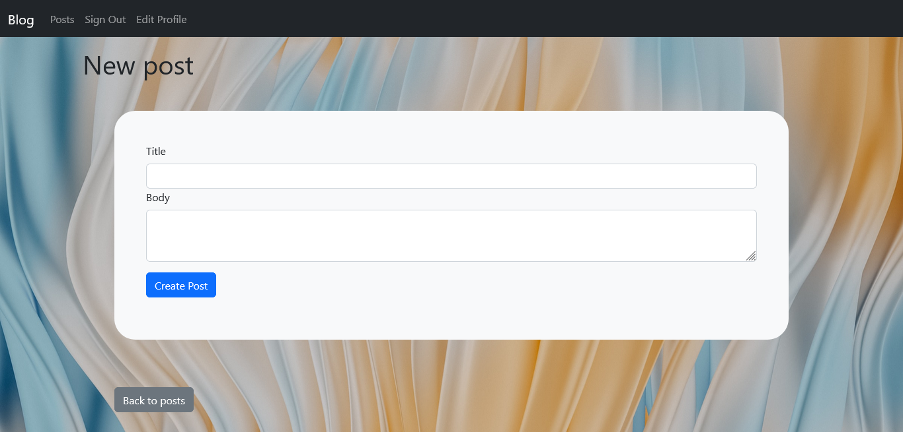

# Blog (Posts with Comments)

TODO: edit comment

* Ruby version: ruby 3.1.2p20

* Rails version: Rails 7.0.3.1

* Database: Sqlite3

---

## Screenshots

Homepage

New Post

Edit Post

Show Post

---

* System dependencies

* Configuration

* Database creation

* Database initialization

* How to run the test suite

* Services (job queues, cache servers, search engines, etc.)

* Deployment instructions

* ...
